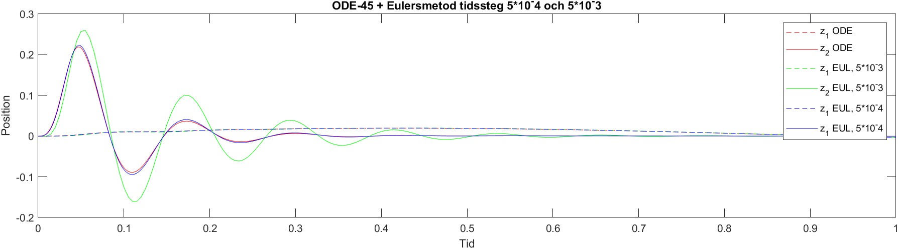
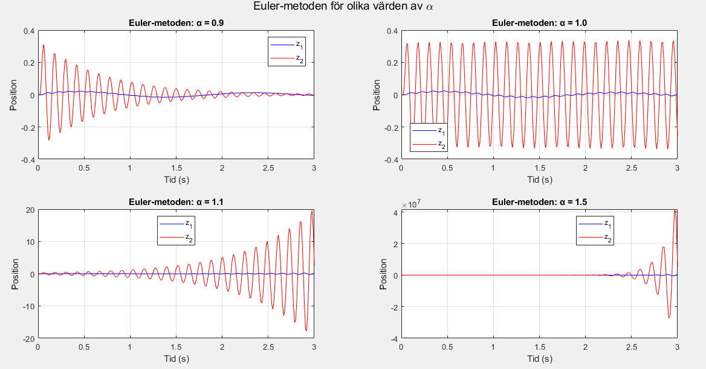
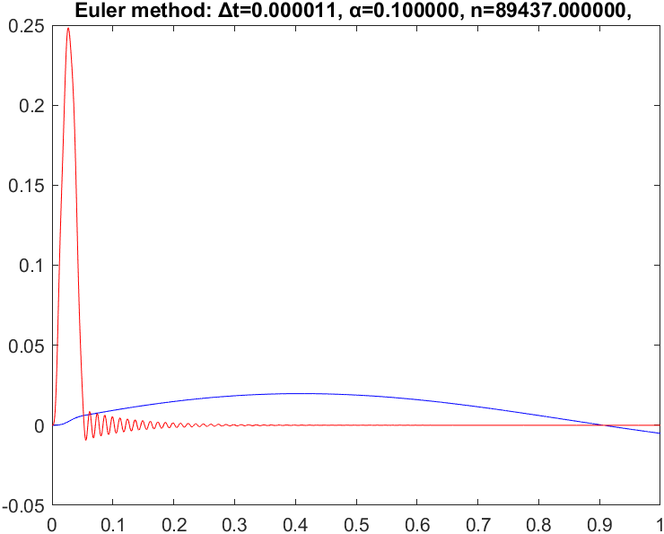
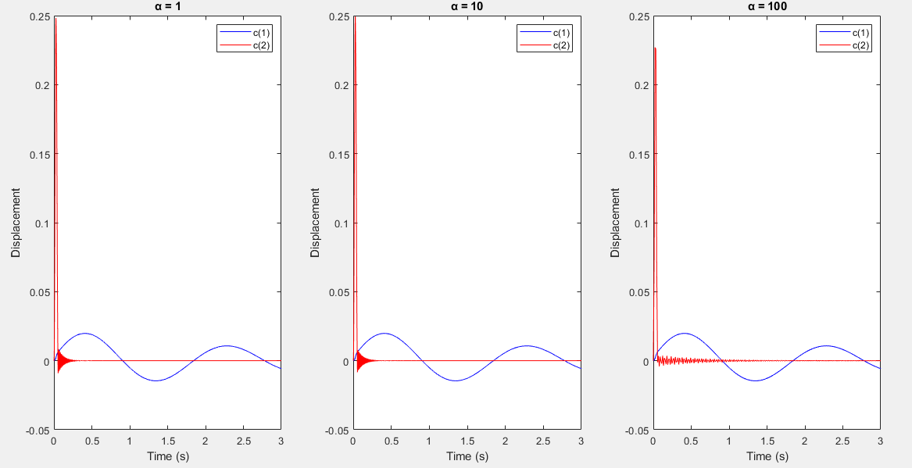
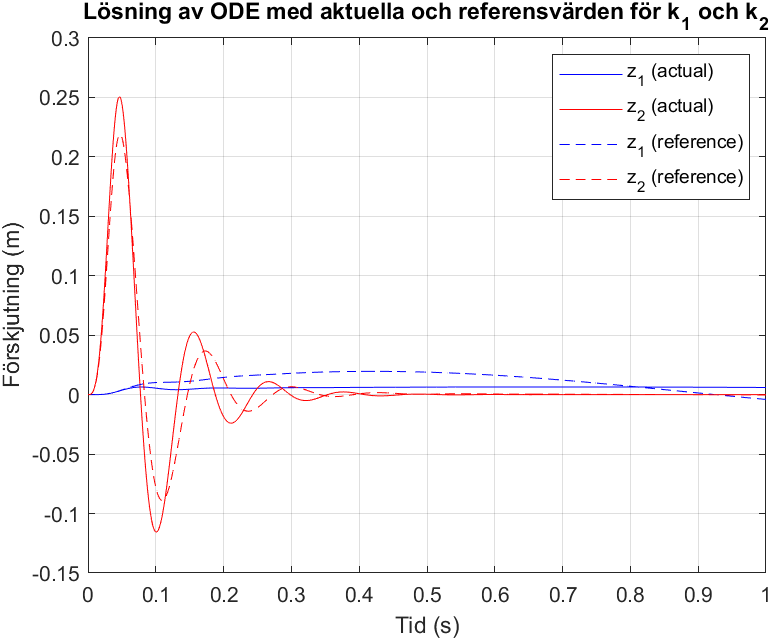

# Quartercar optimization for comfort and safety

This computer laboration is one of three which are part of the Numerical Methods (SF1544) course taken on the Engineering Physics program at KTH university.
The laboration is examined with an on-site examination, and an assessment of our results and code-documentation (Matlab code) in the form of a submission. 
This ReadMe-file is a shorter version of the [actual instructions](https://github.com/user-attachments/files/18180950/QuarterCar2024.pdf) in Swedish of the laboration that have
completed. The answers are briefly dockumented in the code along along with associated graphs explained in english (the lables are the only thing written in Swedish).
All of these answers and plots with desired output are given by running the files mentioned throughout this ReadMe-file. 

Special thanks to my laborationpartner [Mohamad Kanjo](https://github.com/MohiMad).

## Introduction
This project explores a quarter-car suspension system using numerical methods along with knowledge in mechanics,
differential equations, linear algebra, and multivariable calculus to structure and solve ordinary differential equations (ODEs) 
associated with the system's dynamics. 

A vehicle's suspension system connects its chassis and wheels with springs and shock absorbers, which is critical for comfort and road handling. 
The specific system that we have analysed is the following, also refered to as a quarter-car modell,
which is the suspentionsystem connected to one wheel:

The goal is to analyze the stability and accuracy of the suspension system, and optimize parameters for improved ride comfort and safety.

### Parameters

As observed by the figures/image above we have in order:  
$z1, m1, k1, c1$: Chassis displacement, mass, spring constant and damping constant.  
$z2, m2, k2, c2$: Wheel displacement, mass, related spring and damping constant.

Furthermore, h is the vertical position of the road surface, which is given by

$$
h(t) = \begin{cases} 
      \frac{H}{2}(1 - cos(\frac{2 \pi u t}{L})), & t\leq L/u \\
      0 & t\geq L/u 
   \end{cases}
$$

The values of the parameters are given by the follwoing table.
| Parameter | Value     | Units  |
|-----------|-----------|--------|
|   $m_1$   | 475       | $kg$   |
|   $m_2$   | 53        | $kg$   |
|   $k_1$   | 5400      | $N/m$  |
|   $k_2$   | 135000    | $N/m$  |
|   $c_1$   | 310       | Ns/m   |
|   $c_2$   | 1200      | Ns/m   |
|   $u$     | 65/3.6    | m/s    |
|   $H$     | 0.24      | m      |
|   $L$     | 1         | m      |

To describe the equations governing the suspentionsystem we use analytical mechanics to:
1. Choose our generalized paramters z1 and z2 and their respective expressions.
2. Write expressions for the mechanical energy T and potential energy V.
3. Derrive L = T - V with respect to both of our generalized paramters, as well as their **first** derrivatives.
4. Write the related Euler-lagrange equations.

The [Euler-lagrange equations]([https://link-url-here.org](https://en.wikipedia.org/wiki/Euler%E2%80%93Lagrange_equation)) give us the final expressions.

$$
m_1 \ddot{z_1} + c_1(\dot{z_1} - \dot{z_2}) + k_1(z_1 - z_2) = 0
$$

(1)

$$
m_2 \ddot{z_2} + c_1(\dot{z_2} - \dot{z_1}) + c_2(\dot{z_2} - \dot{h}) + k_1(z_2 - z_1) + k_2(z_2 - h) = 0
$$

(2)

Now, we can finally answer the following the questions related to the laboration.

## Q1 - Rewriting the system in first order.
The first question asks us to write the equations governing the movement as a first order differential equation with respect to time, in the form:

$$
\frac{d\mathbf{v}}{dt} = \mathbf{A}\mathbf{v} + \mathbf{g}(t)
$$

(3)

where

$$
\mathbf{v} = \[z_1, z_2, \dot{z_1}, \dot{z_2} \]^T
$$

Simply translating equation (1) and (2) into matrix-form gives us that

$$
A = \begin{bmatrix}
0 & 0 & 1 & 0 \\
0 & 0 & 0 & 1 \\
-\frac{k_1}{m_1} & \frac{k_1}{m_1} & -\frac{c_1}{m_1} & -\frac{c_1}{m_1}\\
\frac{k_1}{m_2} & -\frac{k1 + k2}{m_2} & \frac{c_1}{m_2} & -\frac{c1 + c2}{m_2}
\end{bmatrix}
$$

$$
\mathbf{g}(t) = \begin{bmatrix}
0 \\
0 \\
0 \\
\frac{c_2 \cdot \frac{dh(t)}{dt} + k_2 \cdot h(t)}{m_2}
\end{bmatrix}
$$

where the innitial conditions are given to be $\mathbf{v}_0 = [0, 0, 0, 0]^T$.

## Q2 - Visualisation
The second question asks us to write code that solves the initial value problem from question 1 using the Forward Euler method with different timesteps. We compare these solutions to Matlab's in-built function `ode45`:

From the figure, and using the `max` function, we obtain the maximum height for $z_1$ and $z_2$, as displayed in the commandwindow after running the file **f_2_a_b_c.m** in folder **f_2**, where $z_1$ is the change in height of the car's chassis, which is felt by the passengers.

The forwards Euler method is implemented as following:
The file **f_2_a_b_c.m** calls the function (3) from the file **f2by2.m** and uses it in the iterative process

$$
\mathbf{v}_{n+1} = \mathbf{v}_n + \Delta t f'(t,\mathbf{v}_n)
$$

which is proccessed in the file **EulerSyst.m**.

## Q3 - Solving stiffer systems
The stability condition of the system can be derived using the theory described [here](https://github.com/user-attachments/files/18179754/Absolutstabilitet.2.pdf), 
which in our case gives us the follwing expression:

$$
\Delta t \leq min_{1 \leq k \leq 4}(-\frac{2}{|\lambda_k|^2}Re(\lambda_k))
$$

Where $\lambda_k$ are our eigenvalues for the matrix $A$. The right-hand side of the stability condition is the $\Delta t_{max}$ for which the all systems with timesteps lower than that will converge. The maximum timestep in the condition for the original system is calculated to be $\Delta t_{max} = 0.010781$. Solutions with timesteps larger than $\Delta t_{max}$ blow up to infinity. By varying the timestep for the forward Euler by a factor $\alpha$, we can see how the solution varies depending on whether or not the timestep exceeds $\Delta t_{max}$:

Where the timestep in the figure above was $\Delta t_{max}$ for all graphs. We see how a factor $\alpha = 0.9$ makes the solution converge, while a solution exactly at $\Delta t_{max}$ stays at an equilibrium, while the other solutions shoot up to infinity. 
By making the spring constant $k_2$ a hundred times its original we have a so called stiff system, which makes methods of first order, such as Forward Euler, much more computationally expensive. Since we have changed the original parameter $k_2 = 100k_2^{ref}$ we obtain a new $\Delta t_{max} = 0.000112$. By plottnig the solution using Forward Euler and a factor $\alpha = 0.1$, as asked in the question, we see that the oscillations are of lower amplitude, and that the solution converges:

## Q4 - Implicit transform method
The fourth question asks us to use the implicit transformmethod with the parameter $\theta = 0.5$, which refers to the following iterative process.

$$
\mathbf{v}_{n+1} = \mathbf{v}_n + \Delta t \cdot ((1 - \theta) (A\mathbf{v}_n + \mathbf {g}_n) + \theta(\mathbf{A}\mathbf{v}_{n+1} + \mathbf{g}_{n+1}))  
$$

By using $\theta = 0.5$ we obtain the so-called Trapets-method, which for larger timesteps gives approximately the same accuracy as before, but with quadratically less computations (this can be comfirmed by running the file **u4b.m** which calculate the convergenceorder between $\alpha = 1, 1/2, 1/4, 1/8$ which all come close to 2).
The system is transformed into:

$$
\bar{v}_{n+1}=\left[I-\frac{\Delta t}{2} A\right]^{-1}\left(\bar{v}_r+\frac{\Delta t}{2}\left(A \bar{v}_n+\bar{g}_n+\bar{g}_{n+1}\right)\right)
$$

This function is implemented in the file **EulerSyst_4.m**

We plot the solutions using the Trapets method for $alpha = 1, 10, 100$ respectively to show that the loss of precision is minimal with much less computational power:

After this we are asked to use the same stiff sytem-parameter $k_2 = 100k_2^{ref}$ as earlier, but this time, use time-step $\Delta t = \alpha \Delta t_{max}$ to comfirm that the implicit transformmethod with $\theta = 0.5$ actually keeps the detail of the solution when highering $\alpha$ or not. Running the file **a_f_4.m** allows us to coose our \$\alpha$ to whichever value we want, while the file **u4a.m** compares the graphs of values.

## Q5 - Comfort optimization
Newton's method is an iterative numerical method used for solving equations of the form $F\mathbf x = \mathbf 0$, where $\mathbf x$ is an unkown vector. The method approximates the solution using successive linearizations around an initial guess. With each iteration, the new value is computed as:

$$
\mathbf{x}_{n+1} = \mathbf{x}_n - J(\mathbf{x}_n)^{-1} F(\mathbf{x}_n)
$$

where  $J(\mathbf{x}_n)$ is the Jacobian matrix of $F (\mathbf{x})$, evaluated at $\mathbf{x}_n$.

A transfer function (or signal function) describes the relationship between input and output in the frequency domain for a linear time-independent system. The general transfer function is obtained by Laplace transforming the equations (1) and (2) with respect to time, givin us the following expression (which are dependent on the variable $s$):

$$
Z_1(s) = T_k(s)H(s)
$$

$$
Z_2(s) - H(s) = T_s(s)H(s)
$$

where $Z_1(s), Z_2(s), H(s)$ are the Laplacetransformations of $z_1(t), z_2(t), h(t)$. $T_k(s)$ describes the relationship between the ground and how much the passangers move vertically. $T_s(s)$ describe the relationship between the ground and the difference between the ground and wheels.
In this question, we seek optimal values for the spring constants $k_1$ and $k_2$ that improve ride comfort (minmal value of $|T_k(k_1, k_2)|$) and safety for the passangers (minimal value of $|T_s(k_1, k_2)|$). In our case, we are given that the value of $\tilde{T} _ k (k_1, k_2) = \frac{T _ k (k_1, k_2)}{|T_ k (k_{1,ref},k_{2,ref})|}$ is 71% of the previous value, and that $\tilde{T} _ s (k_1,k_2) = \frac{T _ s (k_1,k_2)}{|T _ s (k_{1,ref},k_{2,ref})|}$ is the same as the previous value. For a more thorough explenation, read more [here](https://en.wikipedia.org/wiki/Transfer_function).

By applying Newton's method to each system respectively, we obtain the new values for the spring constants:

$$
k_1 = 691.5829 \\ 
k_2= 182116.4403
$$

These results are achieved by running the file **u5a.m**.

By trying out different initial guesses and calculating the convergenceorder, we can see that Newton's method, converges to a specific value quadratically (observed in the commandwindow and on the plot by running the file **u5b.m**). 

Notice that we in this case get an overshot at iteration 4 where convergenceorder reaches close to 2, before the iterative formula turns back and approaches correct value with low absolute-tolerance!

To see that these values do infact increase comfort, that is, decrease the amplitude of bumps, we plot the new system and compare it to the original (by running the file **u5c.m**):

We see that indeed, the height of the bumps have reduced while maintaining the same functionality.

## Comments and Improving Points
The current model of the car uses only one wheel (idealized to not account for size and friction at that) and two springs, which is an unrealistic oversimplification. We also worked with an idealized scenario with simple mathematically describable and smooth terrain in slow speeds which allows us to overlook the physical impact of the [jump-conditions for the wheel](https://www.comsol.com/blogs/the-physics-of-a-hopping-hoop). 
For further improvements a half-car model could be presented, taking into account two of the four wheels. This provides a more realistic simulation of how the car behaves in uneven territory.
